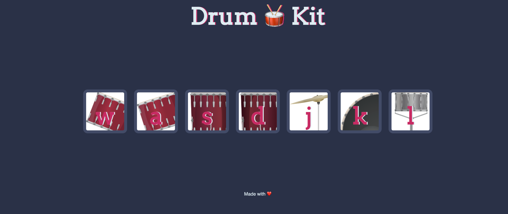

<h1>Drum Kit</h1>

This is a responsive website emulating a drum kit's sound using JavaScript and DOM manipulation. 

There will be a corresponding sound and brief animation for each letter/image pressed or clicked. 

---

<h2>Keystrokes Available</h2>

<ul>
<li>"w"</li>
<li>"a"</li>
<li>"s"</li>
<li>"d"</li>
<li>"j"</li>
<li>"k"</li>
<li>"l"</li>
</ul>